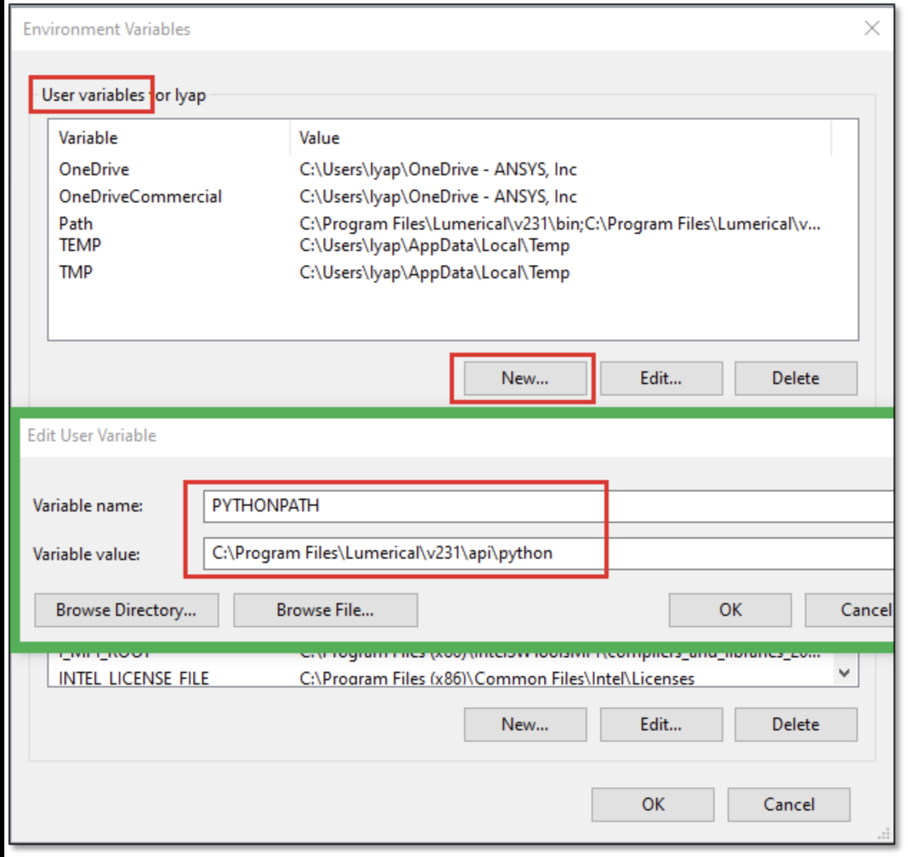

# Griptape Nodes: SAM3/SAM3.1 Library

Segment anything in images and videos using Meta's SAM3 and SAM3.1 (Segment Anything with Concepts) within Griptape Nodes. Use natural language text prompts to identify and segment specific objects with state-of-the-art AI segmentation.

## Features

- **Text-Based Segmentation**: Describe what you want to segment using natural language (e.g., "person", "car", "dog")
- **Image Segmentation**: Segment objects in single images with high precision
- **Video Segmentation**: Track and segment objects across video frames automatically
- **SAM3.1 Object Multiplex**: ~7x faster multi-object tracking with shared memory architecture
- **Multi-Object Support**: Segment multiple objects of the same type in a single pass
- **Colored Mask Overlays**: Visualize segmentation results with customizable colored overlays
- **Confidence Filtering**: Filter results by confidence score threshold
- **HuggingFace Integration**: Automatic model downloading from HuggingFace Hub
- **GPU Acceleration**: CUDA support with TF32 optimization for Ampere+ GPUs
- **torch.compile Support**: Optional compilation for ~31 FPS on H100 (SAM3.1)

## Installation

### Prerequisites

- [Griptape Nodes](https://github.com/griptape-ai/griptape-nodes) installed and running
- Python 3.12 or higher
- CUDA-compatible GPU with sufficient VRAM (8GB+ recommended)
- HuggingFace account with access to SAM3 model
- **Windows only**: [Visual Studio Build Tools](https://visualstudio.microsoft.com/visual-cpp-build-tools/) with C++ compiler (see below)

### Windows: Install Visual Studio Build Tools

SAM3 uses [Triton](https://github.com/triton-lang/triton) which requires a C++ compiler on [Windows](https://github.com/woct0rdho/triton-windows?tab=readme-ov-file#5-c-compiler) .

1. **Download** [Build Tools for Visual Studio 2022](https://visualstudio.microsoft.com/visual-cpp-build-tools/)
2. **Run the installer** and select "Desktop development with C++"
3. **Ensure these components are selected** (at minimum):
   - MSVC v143 (or latest version)
   - Windows 11 SDK (or Windows 10 SDK)

   We recommend installing all default components for the C++ workload.

4. **Restart your computer** after installation


### Update the PATH variable and CC variable in your computer ##
1. Find where your Visual Studio Build Tools are.
2. Copy the path - here is an example path
```
C:\Program Files (x86)\Microsoft Visual Studio\2022\BuildTools\VC\Tools\MSVC\14.44.35207\bin\Hostx64\x64
```
3. Add it to your PATH in your microsoft system settings [Tutorial Here](https://www.wikihow.com/Change-the-PATH-Environment-Variable-on-Windows#:~:text=Editing%20the%20Path%20in%20Windows,directory%20path%20and%20click%20OK.)
4. Add a new User Environment Variable with these values:
```
# Variable Name
CC
# Variable Value
{your-path}\cl.exe
```


### Windows: Install CUDA Toolkit
1. **Download** [CUDA Toolkit 13.1](https://developer.nvidia.com/cuda-downloads?target_os=Windows&target_arch=x86_64&target_version=11&target_type=exe_local)
2. **Run the installer**


### Install the Library

1. **Download the library files** to your Griptape Nodes libraries directory:
   ```bash
   # Navigate to your Griptape Nodes libraries directory
   cd `gtn config show workspace_directory`

   # Clone the library with submodules
   git clone --recurse-submodules https://github.com/griptape-ai/griptape-nodes-library-sam3.git
   ```

2. **Add the library** in the Griptape Nodes Editor:
   * Open the Settings menu and navigate to the *Libraries* settings
   * Click on *+ Add Library* at the bottom of the settings panel
   * Enter the path to the library JSON file: **your Griptape Nodes Workspace directory**`/griptape-nodes-library-sam3/griptape_nodes_sam3_library/griptape-nodes-library.json`
   * You can check your workspace directory with `gtn config show workspace_directory`
   * Close the Settings Panel
   * Click on *Refresh Libraries*

3. **Verify installation** by checking that the "SAM3 Segment Image", "SAM3 Segment Video", and "SAM3.1 Multiplex Video" nodes appear in your Griptape Nodes interface in the "SAM3" category.

## HuggingFace Token Setup

SAM3/SAM3.1 requires access to the gated models on HuggingFace:

1. **Request access** to the SAM3 models:
   - [facebook/sam3](https://huggingface.co/facebook/sam3) - Base SAM3 model
   - [facebook/sam3.1](https://huggingface.co/facebook/sam3.1) - SAM3.1 with Object Multiplex (recommended)
2. **Get your HuggingFace token** from [HuggingFace Settings](https://huggingface.co/settings/tokens)
3. **Configure the token** in Griptape Nodes:
   * Open the *Settings* menu and navigate to *Model Management*
   * Set your `HF_TOKEN` in the HuggingFace section
   * Alternatively, set it as an environment variable:
     ```bash
     export HF_TOKEN="your-huggingface-token-here"
     ```

## Usage

### Image Segmentation

1. **Add the "SAM3 Segment Image" node** to your workflow
2. **Connect an image** to the `input_image` input
3. **Enter a text prompt** describing what to segment (e.g., "person", "cat", "bicycle")
4. **Configure optional settings**:
   - `max_masks`: Maximum number of masks to return
   - `score_threshold`: Minimum confidence score (0.0-1.0)
5. **Run the node** to generate segmentation masks

**Outputs:**
- `output_masks`: List of individual mask images
- `output_composite`: Original image with colored mask overlays
- `num_masks_found`: Number of objects segmented

### Video Segmentation

1. **Add the "SAM3 Segment Video" node** to your workflow
2. **Connect a video** to the `input_video` input
3. **Enter a text prompt** describing what to segment
4. **Configure optional settings**:
   - `prompt_frame`: Frame index to apply the initial prompt (default: 0)
   - `mask_opacity`: Opacity of mask overlays (0.0-1.0)
5. **Run the node** to generate a video with segmentation masks

**Outputs:**
- `output_video`: Video with colored mask overlays
- `num_frames_processed`: Total frames processed
- `num_objects_found`: Number of objects tracked

### SAM3.1 Multiplex Video Segmentation (NEW)

The SAM3.1 Multiplex Video node uses Object Multiplex for ~7x faster multi-object tracking:

1. **Add the "SAM3.1 Multiplex Video" node** to your workflow
2. **Connect a video** to the `input_video` input
3. **Enter text prompts** for multiple objects (comma-separated, e.g., "person, car, dog")
4. **Configure optional settings**:
   - `prompt_frame`: Frame index to apply the initial prompts (default: 0)
   - `mask_opacity`: Opacity of mask overlays (0.0-1.0)
   - `use_torch_compile`: Enable for ~31 FPS on H100 (requires initial compilation time)
5. **Run the node** to generate a video with segmentation masks

**Outputs:**
- `output_masks`: List of individual mask videos (one per object)
- `output_composite`: Video with all colored mask overlays
- `num_frames_processed`: Total frames processed
- `num_objects_found`: Number of objects tracked

## Node Parameters

### SAM3 Segment Image

| Parameter | Type | Description | Default |
|-----------|------|-------------|---------|
| `input_image` | ImageArtifact | Input image to segment | Required |
| `text_prompt` | String | Description of objects to segment | Required |
| `max_masks` | Integer | Maximum masks to return (1-100) | 10 |
| `score_threshold` | Float | Minimum confidence score (0.0-1.0) | 0.5 |

### SAM3 Segment Video

| Parameter | Type | Description | Default |
|-----------|------|-------------|---------|
| `input_video` | VideoUrlArtifact | Input video to segment | Required |
| `text_prompt` | String | Description of objects to segment | Required |
| `prompt_frame` | Integer | Frame index for initial prompt | 0 |
| `mask_opacity` | Float | Mask overlay opacity (0.0-1.0) | 0.4 |

### SAM3.1 Multiplex Video (NEW)

| Parameter | Type | Description | Default |
|-----------|------|-------------|---------|
| `input_video` | VideoUrlArtifact | Input video to segment | Required |
| `text_prompts` | String | Comma-separated list of objects to segment | Required |
| `prompt_frame` | Integer | Frame index for initial prompts | 0 |
| `mask_opacity` | Float | Mask overlay opacity (0.0-1.0) | 0.4 |
| `use_torch_compile` | Boolean | Enable torch.compile for faster inference | false |

## Use Cases

### Object Isolation
Extract specific objects from images for compositing, editing, or analysis.

### Video Object Tracking
Track and segment objects across video frames for visual effects or analysis.

### Content Creation
Create masked overlays for presentations, thumbnails, or social media content.

### Data Annotation
Generate segmentation masks for machine learning dataset preparation.

### Visual Analysis
Identify and highlight specific objects in images or video footage.

## Technical Details

### Dependencies

The library includes the following ML dependencies:
- PyTorch 2.7.0+ with CUDA support
- TorchVision 0.22.0+ for image processing
- SAM3 from Meta's official repository
- OpenCV for video processing
- Triton for GPU kernel optimization

### Model Architecture

SAM3 (Segment Anything with Concepts) extends the original SAM architecture with:
- Text-based prompt understanding via integrated language model
- Concept-aware segmentation for natural language queries
- Video propagation for temporal consistency across frames
- Multi-GPU support for efficient inference

SAM3.1 adds Object Multiplex architecture:
- Shared-memory approach for joint multi-object tracking
- ~7x speedup at 128 objects on a single H100 GPU
- Batches objects into fixed-capacity buckets (16 objects per bucket)
- Flash Attention 3 and torch.compile support (~31 FPS compiled)

### Performance Optimization

- **TF32 Enabled**: Automatic TF32 precision for Ampere+ GPUs
- **GPU Memory Management**: Efficient VRAM usage with model caching
- **Video Processing**: Frame extraction and encoding optimized for throughput

## Troubleshooting

### Common Issues

#### "SAM3 library not installed"
**Solution**: The library auto-installs on first load. Check the console logs for installation progress or errors. Ensure you have internet connectivity for downloading dependencies.

#### "Access denied" or "Model not found"
**Solution**:
- Request access to the SAM3 model at [facebook/sam3](https://huggingface.co/facebook/sam3)
- Verify your HF_TOKEN is set correctly in Model Management settings

#### "CUDA out of memory"
**Solutions**:
- Close other GPU-intensive applications
- Reduce input image/video resolution
- Ensure no other models are loaded in memory

#### Video output not playing
**Solution**: The output video uses H.264 encoding for broad compatibility. If playback issues occur, try opening with VLC or another media player that supports MP4.

#### Slow performance
**Solutions**:
- Ensure CUDA is available (check logs for GPU detection)
- For video, shorter clips process faster
- First run downloads model weights (~2GB), subsequent runs are faster

### Debug Mode

Check the node's `logs` output for detailed information including:
- Model loading status
- Segmentation progress
- Number of objects detected
- Processing time per frame

## Support

- **Issues**: [GitHub Issues](https://github.com/griptape-ai/griptape-nodes-library-sam3/issues)
- **Griptape Community**: [Griptape Discord](https://discord.gg/griptape)
- **Documentation**: [Griptape Nodes Docs](https://github.com/griptape-ai/griptape-nodes)

## Related Projects

- [Griptape Framework](https://github.com/griptape-ai/griptape)
- [Griptape Nodes](https://github.com/griptape-ai/griptape-nodes)
- [SAM3 by Meta](https://github.com/facebookresearch/sam3)

## License

This project is licensed under the Apache License 2.0 - see the [LICENSE](LICENSE) file for details.

---

Made with love for the Griptape community
